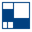

# Examples

Shows how to use gui controls with some common toolkits.

## Toolkits

|                                                                                                       | Examples                                                          | Language                                                                                                                                           | Github sources                                                                                     | SourceForge projects                                                |
|-------------------------------------------------------------------------------------------------------|-------------------------------------------------------------------|----------------------------------------------------------------------------------------------------------------------------------------------------|----------------------------------------------------------------------------------------------------|---------------------------------------------------------------------|
|             | [xtd](https://gammasoft71.wixsite.com/gxtdpro)            | [C++](https://isocpp.org)                                                                                                                          | [xtd/examples](https://github.com/gammasoft71/xtd/tree/master/examples)                | [xtd](https://sourceforge.net/projects/xtdpro/)             |
|       | [Winforms](https://gammasoft71.wixsite.com/gammasoft/csharp)      | [C#](https://docs.microsoft.com/en-us/dotnet/csharp/)                                                                                              | [Examples_CSharp](https://github.com/gammasoft71/Examples_CSharp/tree/master/System.Windows.Forms) | [csharpexample](https://sourceforge.net/p/csharpexample/)           |
|              | [Cocoa (AppKit)](https://gammasoft71.wixsite.com/gammasoft/cocoa) | [Objective-c](https://developer.apple.com/library/archive/documentation/Cocoa/Conceptual/ProgrammingWithObjectiveC/Introduction/Introduction.html) | [Examples_Cocoa](https://github.com/gammasoft71/Examples_Cocoa)                                    | [objectivecexamples](https://sourceforge.net/p/objectivecexamples/) |
|                 | [FLTK](https://gammasoft71.wixsite.com/gammasoft/fltk)            | [C++](https://isocpp.org)                                                                                                                          | [Examples_FLTK](https://github.com/gammasoft71/Examples_FLTK)                                      | [fltkexamples](https://sourceforge.net/p/fltkexamples/)             |
|                    | [Gtk](https://gammasoft71.wixsite.com/gammasoft/gtk)              | [C++](https://isocpp.org)                                                                                                                          | [Examples_Gtk](https://github.com/gammasoft71/Examples_Gtk)                                        | [gtkexamples](https://sourceforge.net/p/gtkexamples/)               |
|              | [Gtkmm](https://gammasoft71.wixsite.com/gammasoft/gtkmm)          | [C++](https://isocpp.org)                                                                                                                          | [Examples_Gtkmm](https://github.com/gammasoft71/Examples_Gtkmm)                                    | [gtkmmexamples](https://sourceforge.net/p/gtkmmexamples/)           |
|                   | [Tkinter](https://gammasoft71.wixsite.com/gammasoft/python)       | [Python](https://python.org)                                                                                                                       | [Examples_Python](https://github.com/gammasoft71/Examples_Python/tree/master/tkinter)              | [pythonexample](https://sourceforge.net/p/pythonexample/)           |
|                       | [Qt / Qt Quick](https://gammasoft71.wixsite.com/gammasoft/qt)     | [C++](https://isocpp.org)                                                                                                                          | [Examples_Qt](https://github.com/gammasoft71/Examples_Qt)                                          | [qtexample](https://sourceforge.net/p/qtexample/)                   |
|              | [Win32 Api](https://gammasoft71.wixsite.com/gammasoft/win32)      | [C++](https://isocpp.org)                                                                                                                          | [Examples_Win32](https://github.com/gammasoft71/Examples_Win32/tree/master/Win32.Gui)              | [win32examples](https://sourceforge.net/p/win32examples/)           |
|            | [wxPython](https://gammasoft71.wixsite.com/gammasoft/python)      | [Python](https://python.org)                                                                                                                       | [Examples_Python](https://github.com/gammasoft71/Examples_Python/tree/master/wxPython)             | [pythonexample](https://sourceforge.net/p/pythonexample/)           |
|  | [wxWidgets](https://gammasoft71.wixsite.com/gammasoft/wxwidgets)  | [C++](https://isocpp.org)                                                                                                                          | [Examples_wxWidgets](https://github.com/gammasoft71/Examples_wxWidgets)                            | [wxwidgetsexamples](https://sourceforge.net/p/wxwidgetsexamples/)   |

## Languages

|                                                                                                      | Examples                                                       | Github sources                                                    | SourceForge projects                                                |
|------------------------------------------------------------------------------------------------------|----------------------------------------------------------------|-------------------------------------------------------------------|---------------------------------------------------------------------|
|                         | [C](https://gammasoft71.wixsite.com/gammasoft/c)               | [Examples_C](https://github.com/gammasoft71/Examples_C)           | [cexamples](https://sourceforge.net/p/cexamples/)                   |
|          | [C#](https://gammasoft71.wixsite.com/gammasoft/csharp)         | [Examples_CSharp](https://github.com/gammasoft71/Examples_CSharp) | [csharpexample](https://sourceforge.net/p/csharpexample/)           |
|                   | [C++](https://gammasoft71.wixsite.com/gammasoft/cpp)           | [Examples_Cpp](https://github.com/gammasoft71/Examples_Cpp)       | [cppexamples](https://sourceforge.net/p/cppexamples/)               |
|  | [Objective-c](https://gammasoft71.wixsite.com/gammasoft/cocoa) | [Examples_Cocoa](https://github.com/gammasoft71/Examples_Cocoa)   | [objectivecexamples](https://sourceforge.net/p/objectivecexamples/) |
|          | [Python](https://gammasoft71.wixsite.com/gammasoft/python)     | [Examples_Python](https://github.com/gammasoft71/Examples_Python) | [pythonexample](https://sourceforge.net/p/pythonexample/)           |

